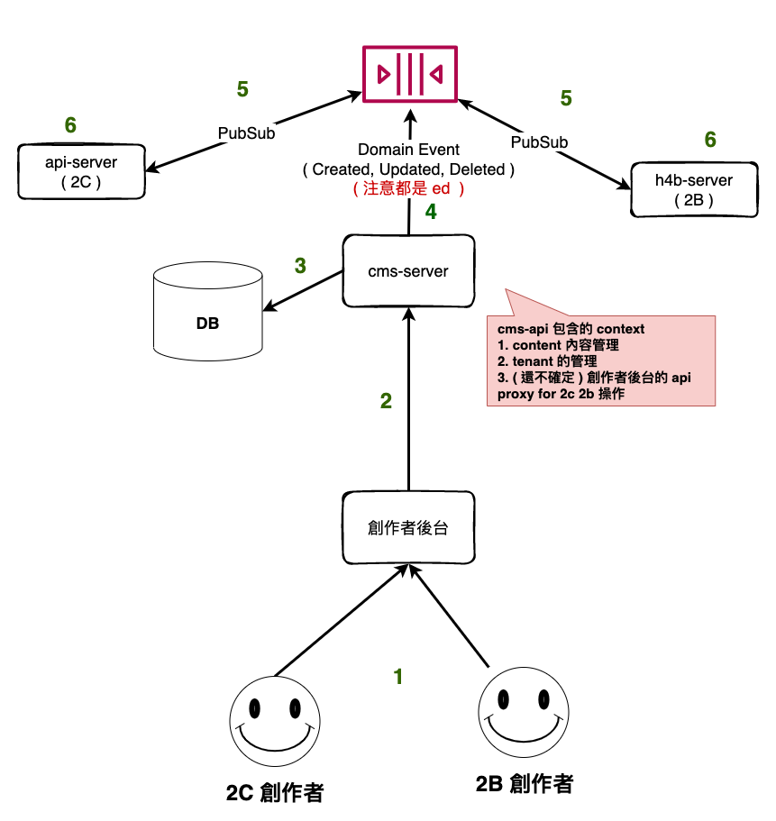
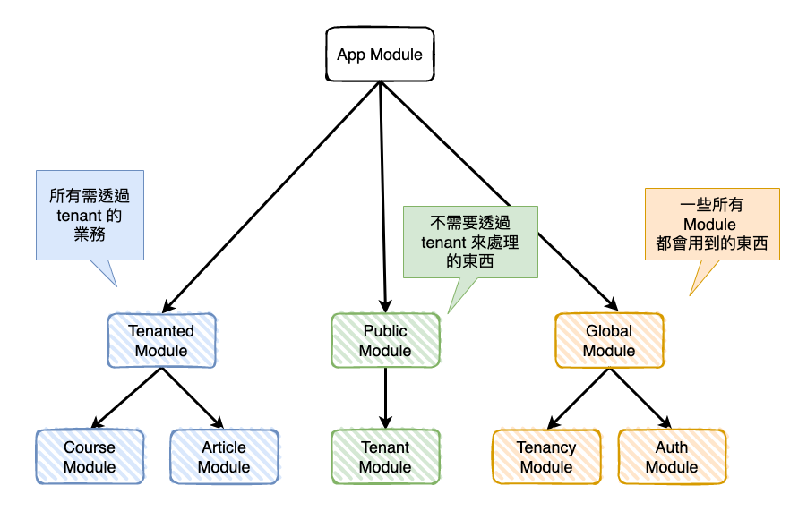
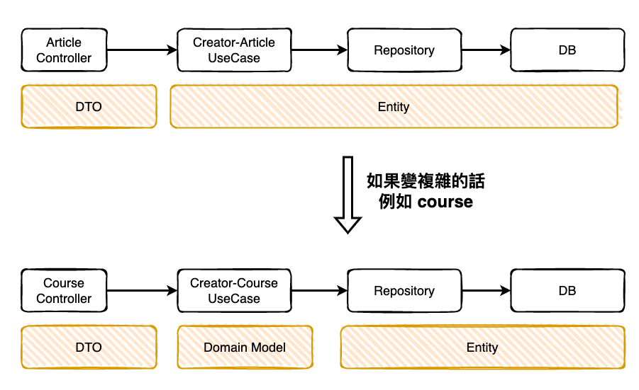

## Description 

該服務目前負責以下的 context 情境 : 

* Tenant 的管理 ( Tenant 是不是以組識或專案來管理，由使用平台來決定 )
* Hahow Content ( Course、Article ) 的管理 

( 備註之後如果該服務要加多處理權限，需要思考的是『 會不會和那個服務職責重疊 』 )

## Build With

* PostgreSQL - RDBMS
* [nestjs ( express base ) ](https://docs.nestjs.com/) : A progressive Node.js framework，會選擇使用主要在於它支援了以下幾個功能 : 
    * 完全的支援 DI Container
    * 強大的 module 支援，可以更有效率的組織 module 與限制使用，有助於未來單一 module 拆分
    * 完全支援 Typescript
    * 支援 OOP、FP、FRP 寫法
    * 其它自已去看文件 
* [jest](https://jestjs.io/) : nestjs 內建預設使用，內建 mock 相關功能，還有快，但我很討厭它的 only
* [typeorm](https://typeorm.io/) : nestjs orm 的預設使用，typeorm 本身有[支援兩種模式](https://typeorm.io/active-record-data-mapper)『 Active Record 』與『 Data Mapper 』 ，然後這裡我選擇了使用 repository，主要原因在於未來好擴展。

## Architecture

本專案為使用 multi tenant 以 PostgreSQL schema base 的方式來管理 hahow content，
可以簡單想成 tenant 就是一個組識，然後每個組識的 content 會放在不同的 PostgreSQL schema，
主要是為了安全。 

然後詳細的討論可以參考以下的文件 : 

[multitenancy 實作面 survey (from 法哥(淚) ](https://www.notion.so/hahow/multitenancy-survey-acce4da55e9741beb150414b92df6609)


然後該專案在整個 hahow 微服務世界會是在以下的位置 : 



### Module

該專案使用 nestjs 所提供的 module 來進行明確的職責分離與限制

先行知識，nestjs module 有分三種類型: 

* root module: 就是最 root 的 module。
* common module: 可以想成多種相同類型組成的 module，本身沒有實作什麼。
* feature module: 就是我們實際寫 feature 的 module。

然後下圖所目前最基礎的 module 說明 : 

* AppModule ( root module ): 就是這個 api 服務最上層的 module，如果有個排程或什麼的，應該是會多個 cronModule 然後會 import 需要用到的其它 module。
* Tenanted Module ( common module ): 所以需要透過 tenant 來操作的 module 都放在此下 ( ex. article, course )
* Public Module ( common module ) : 所有不需透過 tenant 來操作 module 都放在此下 ( ex. tenant 的建立 )
* Global Module ( common module ) : 就是所有其它 module 會共用的一些工具類的 module ( ex. auth, logging )

然後所有 common module 下的都算是 feature module。



## Module Soft Architecture 

理論上來說，每一個 module 內部可以直接決定不同的軟體架構，根據該 module 的複雜度來決定，
然後目前就先以基本算是三層式架構的簡單版變型來當 article 與 tenant 這兩個 module 來處理，
因為目前業務還算簡單。然後基本分為以下幾個層級 : 

* controller: 該 module 對外的接口，然後會由它來執行對應的 usecase。
* dto: 就是 controller -> usecase 的資料封裝層，然後他裡面有實作驗證。
* usecase: 這裡的基本定義為『 XXX 角色對某個 Resource 』所進行的業務使用情境，以 article 為例，目前有個 usecase 叫 creator-article.usecase 就代表這裡專門處理 creator 對 article 做的所有操作，然後如果 staff 或啥的就會多一個叫 staff-article.usecase。
* * 會用這種的原因有兩個，首先想想如果只有一個叫 article service 會變成什麼樣子，第二個原因在於遵守 SRP 原則。
* * 然不用 service 是參考 clean architecture 因為 service 涵蓋範圍太廣了。
* entity: typeorm 的 entity

然後接下來是說一下每個層級之間的 mapping，也就是操作容器，目前由於 article 很簡單，所以長的如下圖，但是如果之後
course 進來後，因為它很複雜所以會考慮多一層 domain model。




## Installation

```bash
$ npm install
```

## Running the app

```bash

$ docker-compose up -d

# development
$ npm run start

# watch mode
$ npm run start:dev

# production mode
$ npm run start:prod
```

## Test

```bash
# unit tests
$ npm run test

# e2e tests
$ npm run test:e2e

# test coverage
$ npm run test:cov
```

## API Doc

```basj

$ npm run start

連到 127.0.0.1/doc
```
